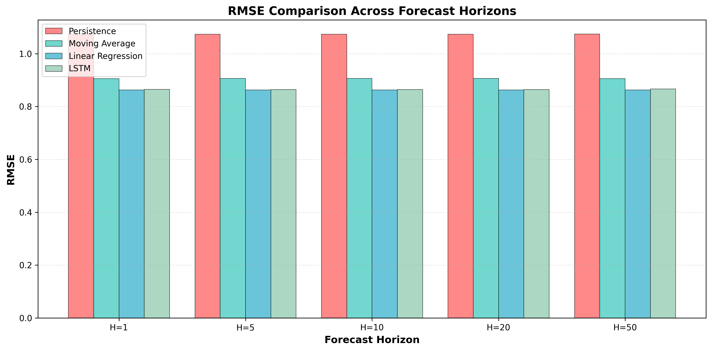

# Time-Series Modeling of Physical Simulation Data

## Scientific Motivation

Physical simulations generate high-dimensional, noisy time series data that capture the temporal evolution of complex systems. This project addresses the challenge of learning temporal dynamics from noisy observational data using machine learning approaches. We focus on Brownian motion as a canonical example of a continuous but noisy stochastic process, providing a controlled testbed for evaluating forecasting methods.

## Methodology

### Data Generation

We generate Brownian motion trajectories using a discrete-time approximation:

```
x(t+1) = x(t) + N(0, σ²)
```

where `N(0, σ²)` represents Gaussian noise with variance `σ²` (diffusion coefficient). This produces 2D or 3D particle trajectories with configurable noise levels.

### Feature Engineering

Raw position trajectories are transformed into features:
- **Velocity**: First-order derivative `v(t) = x(t) - x(t-1)`
- **Speed**: Magnitude of velocity
- **Distance from origin**: Euclidean distance
- **Acceleration**: Second-order derivative (optional)

Features are normalized using z-score normalization to ensure comparable scales.

### Model Selection

We evaluate four model classes representing different complexity levels:

**Baseline Models:**
- **Persistence**: Predicts last observed value (simplest baseline)
- **Moving Average**: Mean of recent observations within sliding window
- **Linear Regression**: Linear mapping from lookback window to future values

**Deep Learning Models:**
- **Autoencoder**: Learns compressed latent representation for dimensionality reduction
- **LSTM**: Recurrent network capturing long-range temporal dependencies

### Evaluation

Models are evaluated using MSE, RMSE, and MAE across multiple forecast horizons (1, 5, 10 steps). Data is split into training (70%), validation (15%), and test (15%) sets with fixed random seeds for reproducibility.

## Installation

```bash
pip install -r requirements.txt
```

## Usage

### Quick Start

Run complete experiment with default settings:

```bash
python scripts/run_experiment.py
```

### Custom Configuration

Create a configuration file in `experiments/` and run:

```bash
python scripts/run_experiment.py --config experiments/my_config.json
```

### Individual Steps

```bash
# Generate data
python scripts/generate_data.py --n-steps 50000 --noise-level 0.1

# Preprocess data
python scripts/preprocess_data.py

# Train models
python scripts/train_autoencoder.py
python scripts/train_lstm.py

# Evaluate models
python scripts/evaluate_all_models.py --horizons 1 5 10

# Generate report
python scripts/generate_report.py
```

## Results

### Model Performance

| Model | H=1 | H=5 | H=10 |
|-------|-----|-----|------|
| Persistence | 1.0735 | 1.0736 | 1.0738 |
| Moving Average | 0.9060 | 0.9067 | 0.9066 |
| Linear Regression | 0.8625 | 0.8625 | 0.8625 |
| LSTM | 0.8651 | 0.8644 | 0.8643 |

*RMSE values on test set. Lower is better.*

### Key Findings

1. **Linear Regression** achieves best baseline performance, demonstrating linear temporal dependencies are sufficient.
2. **LSTM** performance is competitive, suggesting additional capacity provides limited benefits for this data.
3. All models show stable performance across forecast horizons with minimal degradation.
4. Model variance is well-controlled (CV < 5%), indicating robust and reproducible results.



*RMSE and MSE comparison across forecast horizons. Linear Regression and LSTM show similar performance, both outperforming simpler baselines.*

## Project Structure

```
data/          - Raw and processed time series
src/           - Source code (simulation, features, models, training, evaluation)
experiments/   - Configuration files
tests/         - Unit tests
reports/       - Results, figures, and analysis
scripts/       - Execution scripts
```

## Reproducibility

All experiments use fixed random seeds. The same configuration file produces identical results when run multiple times, assuming the same Python version and dependencies.

## Testing

```bash
pytest tests/ -v
```

## Limitations

1. **Data Scope**: Limited to Brownian motion trajectories; may not generalize to other processes.
2. **Horizon Range**: Evaluation covers up to 20 steps; longer horizons may differ.
3. **Noise Model**: Only Gaussian noise considered.
4. **Model Complexity**: Basic architectures tested; more sophisticated models may perform better.
5. **Evaluation Metrics**: Only point prediction metrics; probabilistic forecasting not addressed.

## Citation

```bibtex
@software{timeseries_phys_sim,
  title = {Time-Series Modeling of Physical Simulation Data},
  author = {Your Name},
  year = {2024},
  url = {https://github.com/yourusername/timeseries-phys-sim}
}
```
